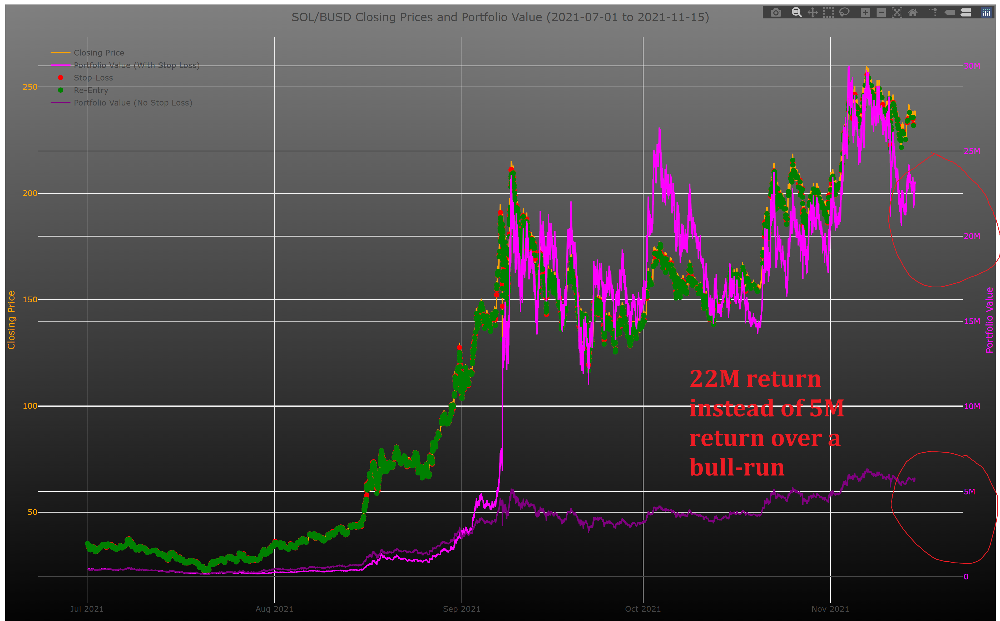

# Alpaca Trader V 1.0

Can trade MSTU

# USAGE

first start the main server for processing the graph
python3 -m http.server

then start the cors-joson-server to receive the orders via javascript
cd Protocol
python3 cors-json-server.py

go to 

http://localhost:8000/Protocol

and trigger one of the HMTLs to write the JSON

go to the CCTX folder and run

python3 fetch_10_minutes.py 

this will delete the graph file and append one line every minute to it. it should
keep on running

you also have to run

loadPage.sh

in the main folder to keep on reloading the main page to trigger calculations in
headless mode

# PURPOSE

This Script uses an advanced Plotting Library that uses the GPU for faster processing to process millions of exact data from Crypto Currency that can be as fine as minute-exact data over the course of many years

Normal libraries like chart.js fail to compute this in reasonable time and offer only a blank screen

This script can simulate the following strategy

=> Exit at a stop-loss
=> Re-entry at a local maximum or minimum

do this millions of times

This increases the returns of a crypto investment by around 1 order of magnitude !!!

# INSTALLATION

run 

python3 -m http.server

go to localhost:8000 in the browser

adjust the parameters in the variables in script.js

you need SOLBUSD.csv separately because it is 133 MB

https://www.cryptoarchive.com.au/bars/SOLBUSD

It is available from here and needs to be in the main folder

you need to run 

gunzip SOLBUSD.csv.gz

see also:

https://www.cryptoarchive.com.au/bars/SUIUSDT

https://www.cryptoarchive.com.au/bars/BTCBUSD

https://www.cryptoarchive.com.au/bars/SOLBUSD